# AirATEC - Sistema de Reservas de Voos ✈️

Este projeto foi desenvolvido no âmbito do fim do curso de aprendizagem "Programador/a de Informática", utilizando **C#**, **WindowsForms**, **ASP.NET (Web Forms)**, e base de dados **MySQL**.

## 🧠 Objetivo

Desenvolver um sistema completo para a empresa fictícia **AirATEC**, permitindo:
- Gestão de utilizadores
- Gestão de voos, reservas, lugares e pagamentos
- Exportação de bilhetes em PDF
- Registo de acessos com data/hora

## 🛠️ Tecnologias utilizadas

- Visual Studio Community
- C# com WindowsForms e ASP.NET (Web Forms)
- MySQL (Workbench)
- PowerPoint (apresentação)

## 📁 Estrutura do Projeto

- `DesktopApp/` - Aplicação desktop (CRUD completo)
- `WebApp/` - Página web para visualização de reservas
- `Database/` - Scripts SQL da base de dados
- `Presentation/` - Apresentação em PowerPoint

## 👨‍💻 Funcionalidades

### Desktop (Admin/User)
- Login com validação e logs de acesso
- Registo e gestão de utilizadores
- Reserva de voos e Reservas com visualização de lugares disponíveis
- Pagamento e Exportação PDF

### Web (User)
- Visualização do histórico de voos
- Download de bilhete

## 🔐 Níveis de Acesso
- `ADMIN`: Acesso total a todas as funcionalidades
- `USER`: Apenas visualização dos seus próprios voos

## 🧪 Printscreens
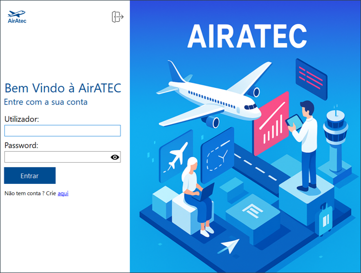
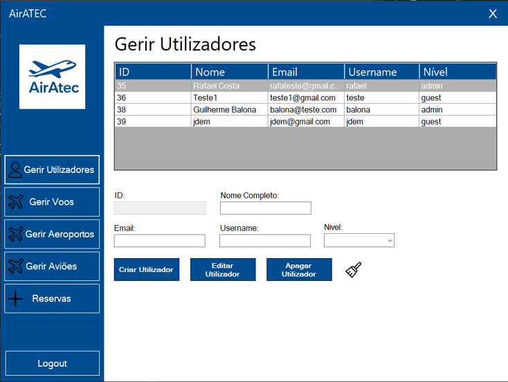
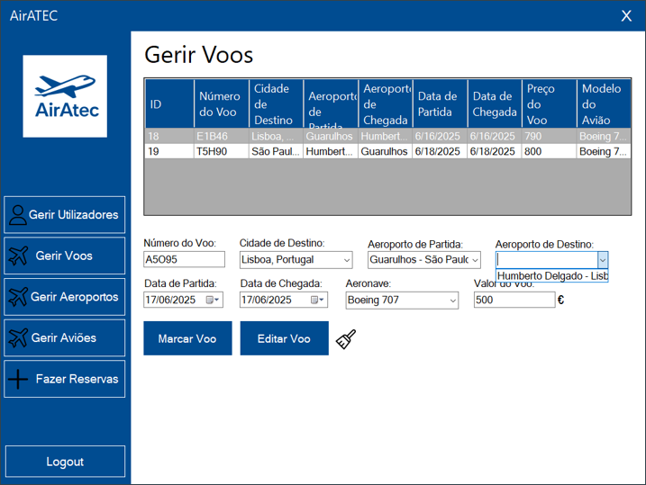
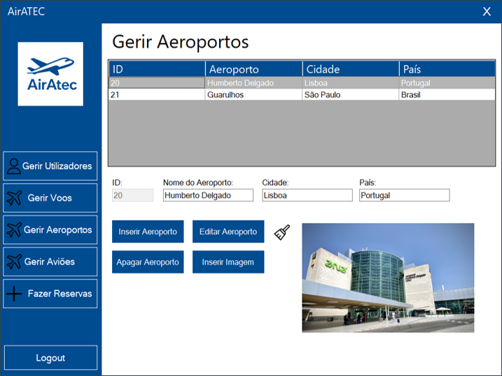
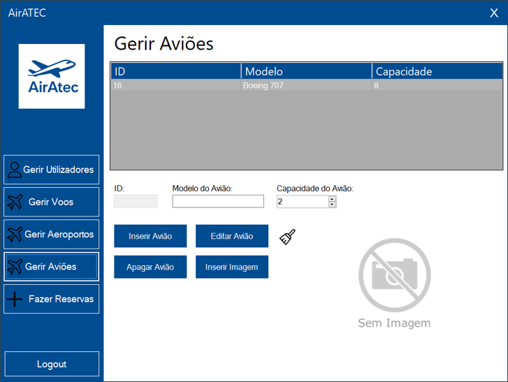
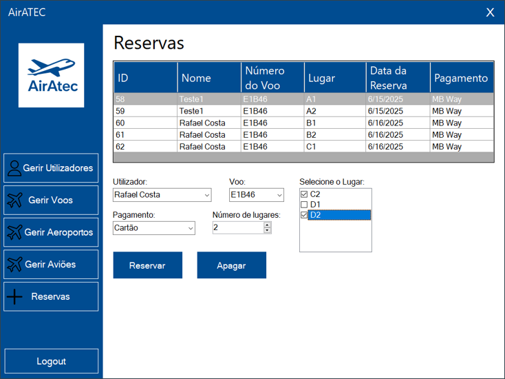
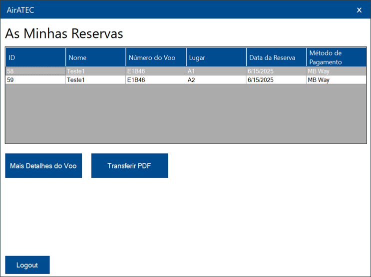
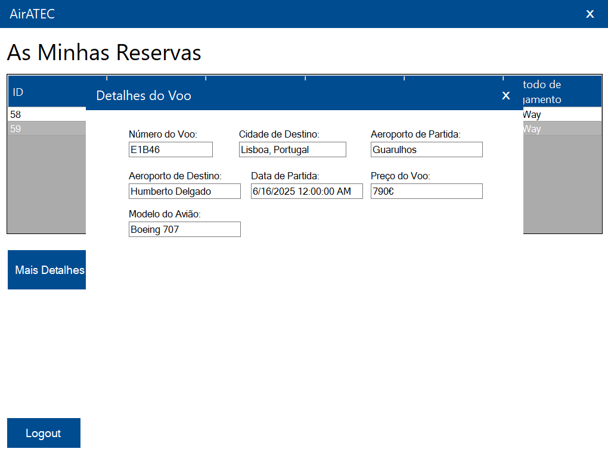
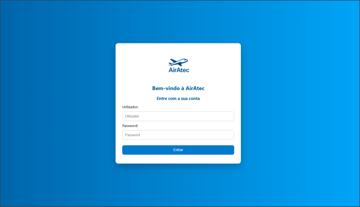
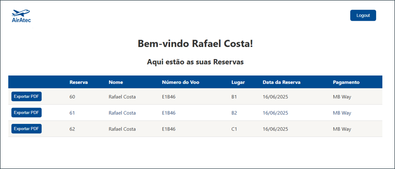
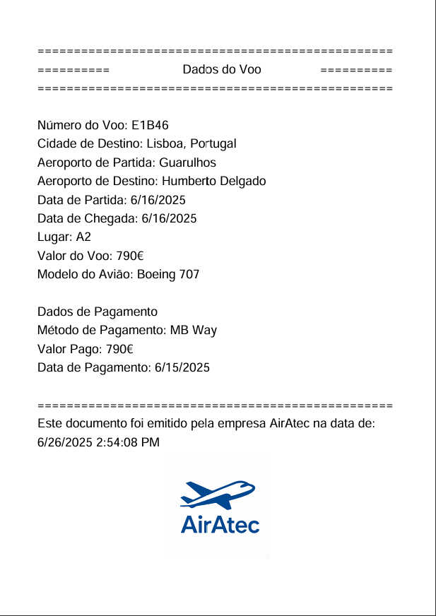

## 📌 Autor
- Nome: Rafael Costa
- Formação: PAF PI0922
- Data: Junho 2025
